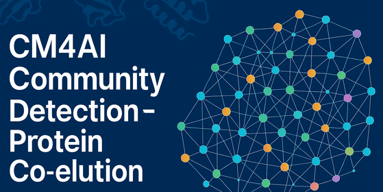

# CM4AI Community Detection - Protein Co-elution Kaggle Competition
- Register for the Competition: https://cm4ai.org/learning/
- Kaggle Competition Website: https://www.kaggle.com/competitions/cm4ai-community-detection-protein-coelution (available after registration)

# Running the Examples
## Kaggle Notebook Environment
1. Register for the competition (https://cm4ai.org/learning/)
2. Open the competition site on Kaggle (https://www.kaggle.com/competitions/cm4ai-community-detection-protein-coelution)
3. Go to the competition Code panel (https://www.kaggle.com/competitions/cm4ai-community-detection-protein-coelution/code)
4. Create a new notebook
5. Click File -> Import notebook
6. Select the GitHub panel and enter this repository's name (acomphealth/cm4ai-kaggle-community-detection)
7. Select notebooks/example-commdet-kaggle.ipynb and import the notebook
8. Click Add-ons -> Install Dependencies then enter the following and click save:
```
pip install cellmaps_pipeline
```
9. You can now run Submit to competition from the right hand Notebook panel or start the session to work with the code
   - If working with the notebook directly, you will need to install the dependencies after starting the session. Click Add-ons -> Install Dependencies and click Run, then wait for the installation to complete. Afterwards, click Run -> Restart & clear cell outputs

## Local Environment
1. Clone this repository
2. Create conda environment
```
conda env create -f environment.yml
```
3. Activate the environment
```
conda activate cm4ai-kaggle-commdet
```
4. Register for the competition (https://cm4ai.org/learning/)
5. Go to your Kaggle (https://www.kaggle.com) profile page, select Settings, scroll down to the API section, and click "Create New Token" and move the downloaded token to ~/.kaggle/kaggle.json
6. Open the local notebook example (notebooks/example-commdet-local.ipynb) to run the code and submit the result file